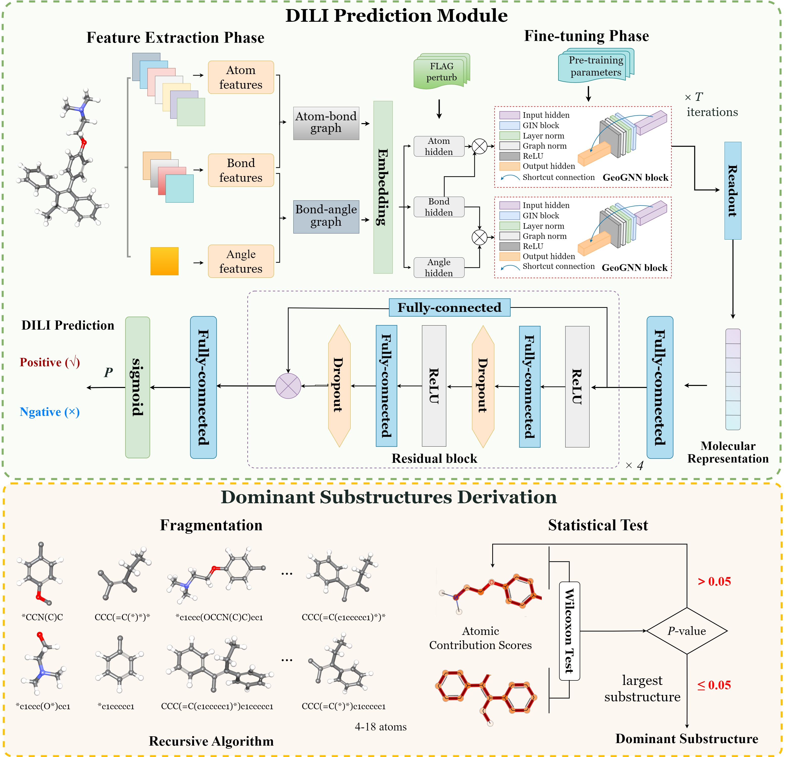
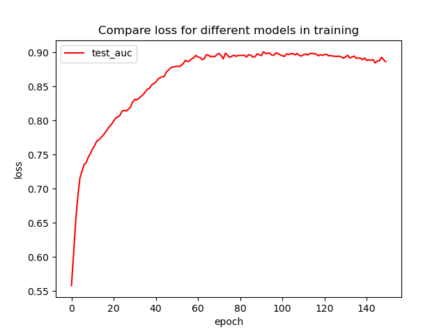
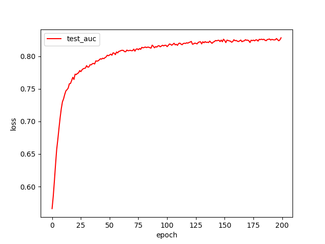

# GeoDILI: a robust and interpretable graph neural network for Drug-Induced Liver Injury prediction using molecular geometric representation

# Background
In this study, we developed a highly accurate and interpretable human DILI prediction model named GeoDILI. An overview of the proposed model is shown in following figure:  



The GeoDILI model used a pre-trained 3D spatial structure-based GNN to extract molecular representations, followed by a residual neural network to make an accurate DILI prediction. The gradient information from the final graph convolutional layer of GNN was utilized to obtain atom-based weights, which enabled the identification of dominant substructures that significantly contributed to DILI prediction. We evaluated the performance of GeoDILI by comparing it with the SOTA DILI prediction tools, popular GNN models, as well as conventional Deep Neural Networks (DNN) and ML models, confirming its effectiveness in predicting DILI. In addition, we applied our model to three different human DILI datasets from various sources, namely DILIrank, DILIst, and a dataset recently collected by Yan et al.. Results showed performance differences across datasets and suggested that a smaller, high-quality dataset DILIrank may lead to better results. Finally, we applied the dominant substructure inference method to analyze the entire DILIrank dataset and identified seven significant SAs with both high precision and potential mechanisms. 


# Installation guide
## Prerequisites

* OS support: Windows
* Python version: 3.6, 3.7, 3.8

## Dependencies

| name         | version |
|   ------------   |   ----   |
| pandas           | \==1.3.5 |
| networkx         | \==2.6.3 |
| paddlepaddle-gpu | \==2.0.0 |
| pgl              | \==2.2.4 |
| rdkit-pypi       | \==2022.3.5 |
| sklearn          | \==1.0.2 |
| tqdm             | \==4.64.0 |
| prettytable      | \==3.4.1 |
| matplotlib       | \==3.5.2 |
Please use the following environment installation command:
$ pip3 install -r requirements.txt
Note that the requirements.txt file does not contain the command to install paddlepaddle-gpu, you need to run the following command to install it separately:
$ python -m pip install paddlepaddle-gpu==2.3.2.post112 -f https://www.paddlepaddle.org.cn/whl/windows/mkl/avx/stable.html
# Usage

To train a model with an existing dataset:

    $ python main.py --dataset_name dilirank --task train --split_type random
    $ python main.py --dataset_name rega --task train --split_type random
    $ python main.py --dataset_name diliset --task train --split_type random
    $ python main.py --dataset_name bbbp --task train --split_type random

To test with an existing model:

    $ python main.py --dataset_name dilirank --task test --split_type random
    $ python main.py --dataset_name rega --task test --split_type random

## Result

|     Dataset      |    AUC    |    ACC    |    MCC    |
| :--------------: | :-------: | :-------: | :-------: |
|     DILIrank     | **0.908** | **0.875** | **0.732** |
|      DILIst      | **0.851** | **0.786** | **0.553** |
| Yan et al (rega) | **0.843** | **0.773** | **0.549** |

|                           DILIrank                           |                     Yan et al(rega)                     |
| :----------------------------------------------------------: | :-----------------------------------------------------: |
|  |  |


## Citation

If you use the code or data in this package, please cite:

```bibtex

```
